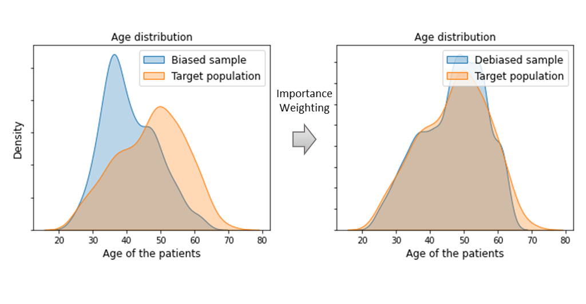
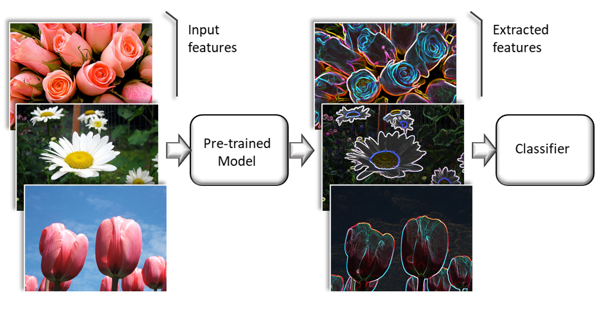
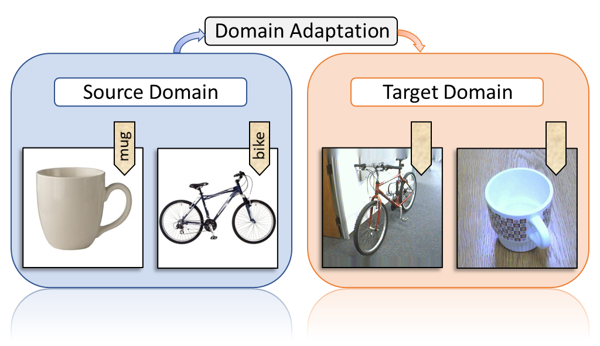
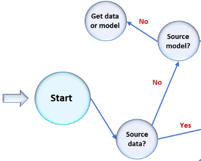
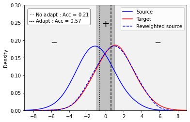

# ADAPT

[](https://pypi.org/project/adapt)
[](https://github.com/adapt-python/adapt/actions)
[](https://img.shields.io/badge/python-3.6%20|%203.7%20|%203.8|%203.9-blue)
[](https://codecov.io/gh/adapt-python/adapt)

**A**wesome **D**omain **A**daptation **P**ython **T**oolbox

---

ADAPT is an open source library providing numerous tools to perform Transfer Learning and Domain Adaptation.

The purpose of the ADAPT library is to facilitate the access to transfer leanring algorithms for a large public, including industrial players. ADAPT is specifically designed for [Scikit-learn](https://scikit-learn.org/stable/) and [Tensorflow](https://www.tensorflow.org/) users with a "user-friendly" approach. All objects in ADAPT implement the ***fit***, ***predict*** and ***score*** methods like any scikit-learn object. A very detailed documentation with several examples is provided:

:arrow_right: [Documentation](https://adapt-python.github.io/adapt/)

<table>
  <tr valign="top">
    <td width="50%" >
        <a href="doc/examples/Sample_bias_example.html">
            <br>
            <b>Sample bias correction</b>
            <br>
            <br>
            
        </a>
    </td>
    <td width="50%">
        <a href="doc/examples/Flowers_example.html">
            <br>
            <b>Model-based Transfer</b>
            <br>
            <br>
            
        </a>
    </td>
  </tr>
  <tr valign="top">
    <td width="50%">
        <a href="doc/examples/Flowers_example.html">
            <br>
            <b>Deep Domain Adaptation</b>
            <br>
            <br>
            
        </a>
    </td>
    <td width="50%">
        <a href="https://adapt-python.github.io/adapt/examples/Multi_fidelity.html">
            <br>
            <b>Multi-Fidelity Transfer</b>
            <br>
            <br>
            
        </a>
    </td>
  </tr>
</table>

## Installation and Usage

This package is available on [Pypi](https://pypi.org/project/adapt) and can be installed with the following command line: 

```
pip install adapt
```

The following dependencies are required and will be installed with the library:
- `numpy`
- `scipy`
- `tensorflow` (>= 2.0)
- `scikit-learn`
- `cvxopt`

If for some reason, these packages failed to install, you can do it manually with:

```
pip install numpy scipy tensorflow scikit-learn cvxopt
```

Finally import the module in your python scripts with:

```python
import adapt
```

An simple example of usage is given in the [Qick-Start](#Quick-Start) below.


## ADAPT Guideline

The transfer learning methods implemented in ADAPT can be seen as scikit-learn "Meta-estimators" or tensorflow "Custom Model":

<table>
<tr valign="top">
<td width="33%" >
<br>
<b>Adapt Estimator</b>
<br>
<br>
	
```python
AdaptEstimator(
	estimator = """A scikit-learn estimator
	            (like Ridge(alpha=1.) for example)
		    or a Tensorflow Model""",
	Xt = "The target input features",
	yt = "The target output labels (if any)",
	**params = "Hyper-parameters of the AdaptEstimator"
)
```
	
<td width="33%">
<br>
<b>Deep Adapt Estimator</b>
<br>
<br>

	
```python
DeepAdaptEstimator(
	encoder = "A Tensorflow Model (if required)",
	task = "A Tensorflow Model (if required)",
	discriminator = "A Tensorflow Model (if required)",
	Xt = "The target input features",
	yt = "The target output labels (if any)",
	**params = """Hyper-parameters of the DeepAdaptEstimator and
		      the compile and fit params (optimizer, epochs...)"""
)
```
	

</td>
	
	
</td>
<td width="33%">
<br>
<b>Scikit-learn Meta-Estimator</b>
<br>
<br>
	
```python
SklearnMetaEstimator(
	base_estimator = """A scikit-learn estimator
			 (like Ridge(alpha=1.) for example)""",
	**params = "Hyper-parameters of the SklearnMetaEstimator"
)
```
	

</td>
</tr>
</table>


As you can see, the main difference between ADAPT models and scikit-learn and tensorflow objects is the two arguments `Xt, yt` which refer to the target data. Indeed, in classical machine learning, one assumes that the fitted model is applied on data distributed according to the training distribution. This is why, in this setting, one performs cross-validation and splits uniformly the training set to evaluate a model.

In the transfer learning framework, however, one assumes that the target data (on which the model will be used at the end) are not distributed like the source training data. Moreover, one assumes that the target distribution can be estimated and compared to the training distribution. Either because a small sample of labeled target data `Xt, yt` is avalaible or because a large sample of unlabeled target data `Xt` is at one's disposal.

Thus, the transfer learning models from the ADAPT library can be seen as machine learning models that are fitted with a specific target in mind. This target is different but somewhat related to the training data. This is generally achieved by a transformation of the input features (see [feature-based transfer](https://adapt-python.github.io/adapt/contents.html#adapt-feature-based-feature-based-methods)) or by importance weighting (see [instance-based transfer](https://adapt-python.github.io/adapt/contents.html#adapt-instance-based)). In some cases, the training data are no more available but one aims at fine-tuning a pre-trained source model on a new target dataset (see [parameter-based transfer](https://adapt-python.github.io/adapt/contents.html#adapt-parameter-based)).


## Navigate into ADAPT

The ADAPT library proposes numerous transfer algorithms and it can be hard to know which algorithm is best suited for a particular problem. If you do not know which algorithm to choose, this [flowchart](https://adapt-python.github.io/adapt/map.html) may help you:

[](https://adapt-python.github.io/adapt/map.html)


## Quick Start

Here is a simple usage example of the ADAPT library. This is a simulation of a 1D sample bias problem with binary classfication task. The source input data are distributed according to a Gaussian distribution centered in -1 with standard deviation of 2. The target data are drawn from Gaussian distribution centered in 1 with standard deviation of 2. The output labels are equal to 1 in the interval [-1, 1] and 0 elsewhere. We apply the transfer method [KMM](https://adapt-python.github.io/adapt/generated/adapt.instance_based.KMM.html) which is an unsupervised instance-based algortihm.

```python
# Import standard librairies
import numpy as np
from sklearn.linear_model import LogisticRegression

# Import KMM method form adapt.instance_based module
from adapt.instance_based import KMM

np.random.seed(0)

# Create source dataset (Xs ~ N(-1, 2))
# ys = 1 for ys in [-1, 1] else, ys = 0
Xs = np.random.randn(1000, 1)*2-1
ys = (Xs[:, 0] > -1.) & (Xs[:, 0] < 1.)

# Create target dataset (Xt ~ N(1, 2)), yt ~ ys
Xt = np.random.randn(1000, 1)*2+1
yt = (Xt[:, 0] > -1.) & (Xt[:, 0] < 1.)

# Instantiate and fit a source only model for comparison
src_only = LogisticRegression(penalty="none")
src_only.fit(Xs, ys)

# Instantiate a KMM model : estimator and target input
# data Xt are given as parameters with the kernel parameters
adapt_model = KMM(
    estimator=LogisticRegression(penalty="none"), 
    Xt=Xt,
    kernel="rbf",  # Gaussian kernel
    gamma=1.,     # Bandwidth of the kernel
    verbose=0,
    random_state=0
)

# Fit the model.
adapt_model.fit(Xs, ys);

# Get the score on target data
adapt_model.score(Xt, yt)
```
```python
>>> 0.574
```

|  | 
|:--:| 
| **Quick-Start Plotting Results**. *The dotted and dashed lines are respectively the class separation of the "source only" and KMM models. Note that the predicted positive class is on the right of the dotted line for the "source only" model but on the left of the dashed line for KMM. (The code for plotting the Figure is available [here](docs/examples/Quick_start.html))* |


## Contents

ADAPT package is divided in three sub-modules containing the following domain adaptation methods:

### Feature-based methods


- [FA](https://adapt-python.github.io/adapt/generated/adapt.feature_based.FA.html) (*Frustratingly Easy Domain Adaptation*) [[paper]](https://arxiv.org/pdf/0907.1815.pdf)
- [SA](https://adapt-python.github.io/adapt/generated/adapt.feature_based.SA.html) (*Subspace Alignment*) [[paper]](https://arxiv.org/abs/1409.5241)
- [fMMD](https://adapt-python.github.io/adapt/generated/adapt.feature_based.SA.html) (*feature Selection with MMD*) [[paper]](https://www.cs.cmu.edu/afs/cs/Web/People/jgc/publication/Feature%20Selection%20for%20Transfer%20Learning.pdf)
- [DANN](https://adapt-python.github.io/adapt/generated/adapt.feature_based.DANN.html) (*Discriminative Adversarial Neural Network*) [[paper]](https://jmlr.org/papers/volume17/15-239/15-239.pdf)
- [ADDA](https://adapt-python.github.io/adapt/generated/adapt.feature_based.ADDA.html) (*Adversarial Discriminative Domain Adaptation*) [[paper]](https://arxiv.org/pdf/1702.05464.pdf)
- [CORAL](https://adapt-python.github.io/adapt/generated/adapt.feature_based.CORAL.html) (*CORrelation ALignment*) [[paper]](https://arxiv.org/pdf/1511.05547.pdf)
- [DeepCORAL](https://adapt-python.github.io/adapt/generated/adapt.feature_based.DeepCORAL.html) (*Deep CORrelation ALignment*) [[paper]](https://arxiv.org/pdf/1607.01719.pdf)
- [MCD](https://adapt-python.github.io/adapt/generated/adapt.feature_based.MCD.html) (*Maximum Classifier Discrepancy*) [[paper]](https://arxiv.org/pdf/1712.02560.pdf)
- [MDD](https://adapt-python.github.io/adapt/generated/adapt.feature_based.MDD.html) (*Margin Disparity Discrepancy*) [[paper]](https://arxiv.org/pdf/1904.05801.pdf)
- [WDGRL](https://adapt-python.github.io/adapt/generated/adapt.feature_based.WDGRL.html) (*Wasserstein Distance Guided Representation Learning*) [[paper]](https://arxiv.org/pdf/1707.01217.pdf)
- [CDAN](https://adapt-python.github.io/adapt/generated/adapt.feature_based.CDAN.html) (*Conditional Adversarial Domain Adaptation*) [[paper]](https://arxiv.org/pdf/1705.10667.pdf)
- [CCSA](https://adapt-python.github.io/adapt/generated/adapt.feature_based.CCSA.html) (*Classification and Contrastive Semantic Alignment*) [[paper]](https://arxiv.org/abs/1709.10190)

### Instance-based methods


- [LDM](https://adapt-python.github.io/adapt/generated/adapt.instance_based.LDM.html) (*Linear Discrepancy Minimization*) [[paper]](https://arxiv.org/pdf/0902.3430.pdf)
- [KMM](https://adapt-python.github.io/adapt/generated/adapt.instance_based.KMM.html) (*Kernel Mean Matching*) [[paper]](https://proceedings.neurips.cc/paper/2006/file/a2186aa7c086b46ad4e8bf81e2a3a19b-Paper.pdf)
- [KLIEP](https://adapt-python.github.io/adapt/generated/adapt.instance_based.KLIEP.html) (*Kullback–Leibler Importance Estimation Procedure*) [[paper]](https://proceedings.neurips.cc/paper/2007/file/be83ab3ecd0db773eb2dc1b0a17836a1-Paper.pdf)
- [TrAdaBoost](https://adapt-python.github.io/adapt/generated/adapt.instance_based.TrAdaBoost.html) (*Transfer AdaBoost*) [[paper]](https://cse.hkust.edu.hk/~qyang/Docs/2007/tradaboost.pdf)
- [TrAdaBoostR2](https://adapt-python.github.io/adapt/generated/adapt.instance_based.TrAdaBoostR2.html) (*Transfer AdaBoost for Regression*) [[paper]](https://www.cs.utexas.edu/~dpardoe/papers/ICML10.pdf)
- [TwoStageTrAdaBoostR2](https://adapt-python.github.io/adapt/generated/adapt.instance_based.TwoStageTrAdaBoostR2.html) (*Two Stage Transfer AdaBoost for Regression*) [[paper]](https://www.cs.utexas.edu/~dpardoe/papers/ICML10.pdf)
- [NearestNeighborsWeighting](https://adapt-python.github.io/adapt/generated/adapt.instance_based.NearestNeighborsWeighting.html) (*Nearest Neighbors Weighting*) [[paper]](https://arxiv.org/pdf/2102.02291.pdf)
- [WANN](https://adapt-python.github.io/adapt/generated/adapt.instance_based.WANN.html) (*Weighting Adversarial Neural Network*) [[paper]](https://arxiv.org/pdf/2006.08251.pdf)

### Parameter-based methods


- [RegularTransferLR](https://adapt-python.github.io/adapt/generated/adapt.parameter_based.RegularTransferLR.html) (*Regular Transfer with Linear Regression*) [[paper]](https://www.microsoft.com/en-us/research/wp-content/uploads/2004/07/2004-chelba-emnlp.pdf)
- [RegularTransferLC](https://adapt-python.github.io/adapt/generated/adapt.parameter_based.RegularTransferLC.html) (*Regular Transfer with Linear Classification*) [[paper]](https://www.microsoft.com/en-us/research/wp-content/uploads/2004/07/2004-chelba-emnlp.pdf)
- [RegularTransferNN](https://adapt-python.github.io/adapt/generated/adapt.parameter_based.RegularTransferNN.html) (*Regular Transfer with Neural Network*) [[paper]](https://hal.inria.fr/hal-00911179v1/document)
- [FineTuning](https://adapt-python.github.io/adapt/generated/adapt.parameter_based.FineTuning.html) (*Fine-Tuning*) [[paper]](https://hal.inria.fr/hal-00911179v1/document)
- [TransferTreeClassifier](https://adapt-python.github.io/adapt/generated/adapt.parameter_based.TransferTreeClassifier.html) (*Transfer Tree Classifier*) [[paper]](https://ieeexplore.ieee.org/document/8995296)
- [TransferTreeForest](https://adapt-python.github.io/adapt/generated/adapt.parameter_based.TransferTreeForest.html) (*Transfer Tree Forest*) [[paper]](https://ieeexplore.ieee.org/document/8995296)


## Reference

If you use this library in your research, please cite ADAPT using the following reference: https://arxiv.org/pdf/2107.03049.pdf

```
@article{de2021adapt,
	  title={ADAPT: Awesome Domain Adaptation Python Toolbox},
	  author={de Mathelin, Antoine and Deheeger, Fran{\c{c}}ois and Richard, Guillaume and Mougeot, Mathilde and Vayatis, Nicolas},
	  journal={arXiv preprint arXiv:2107.03049},
	  year={2021}
	}
```

## Acknowledgement

This work has been funded by Michelin and the Industrial Data Analytics and Machine Learning chair from ENS Paris-Saclay, Borelli center.

[](https://www.michelin.com/)  
