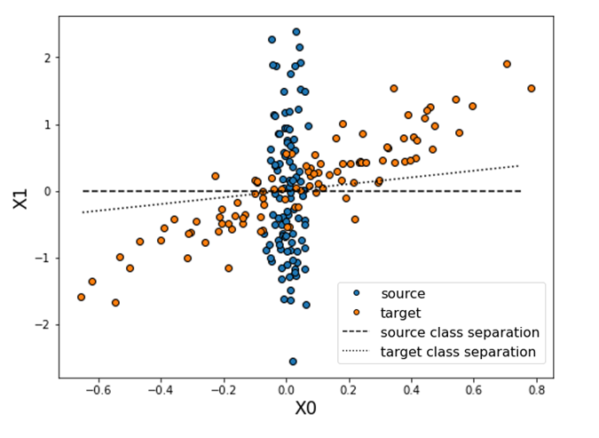

# ADAPT

[](https://pypi.org/project/adapt)
[](https://github.com/adapt-python/adapt/actions)
[](https://img.shields.io/badge/python-3.5%20|%203.6%20|%203.7-blue)
[](https://codecov.io/gh/adapt-python/adapt)

**A**wesome **D**omain **A**daptation **P**ackage **T**oolbox

ADAPT is a python library which provides several domain adaptation methods implemented with [Tensorflow](https://www.tensorflow.org/) and [Scikit-learn](https://scikit-learn.org/stable/).

## Documentation Website

Find the details of all implemented methods as well as illustrative examples here: [ADAPT Documentation Website](https://adapt-python.github.io/adapt/)

## Installation

This package is available on [Pypi](https://pypi.org/project/adapt) and can be installed with the following command line:

```
pip install adapt
```

The following dependencies are required and will be installed with the library:
- `numpy`
- `scipy`
- `tensorflow` (>= 2.0)
- `scikit-learn`
- `cvxopt`

If for some reason, these packages failed to install, you can do it manually with:

```
pip install numpy scipy tensorflow scikit-learn cvxopt
```

Finally import the module in your python scripts with:

```python
import adapt
```

## Reference

If you use this library in your research, please cite ADAPT using the following reference: https://arxiv.org/pdf/2107.03049.pdf

```
@article{de2021adapt,
	  title={ADAPT: Awesome Domain Adaptation Python Toolbox},
	  author={de Mathelin, Antoine and Deheeger, Fran{\c{c}}ois and Richard, Guillaume and Mougeot, Mathilde and Vayatis, Nicolas},
	  journal={arXiv preprint arXiv:2107.03049},
	  year={2021}
	}
```


## Quick Start

```python
import numpy as np
from adapt.feature_based import DANN
np.random.seed(0)

# Xs and Xt are shifted along the second feature.
Xs = np.concatenate((np.random.random((100, 1)),
                     np.zeros((100, 1))), 1)
Xt = np.concatenate((np.random.random((100, 1)),
                     np.ones((100, 1))), 1)
ys = 0.2 * Xs[:, 0]
yt = 0.2 * Xt[:, 0]

# With lambda set to zero, no adaptation is performed.
model = DANN(lambda_=0., random_state=0)
model.fit(Xs, ys, Xt, yt, epochs=100, verbose=0)
print(model.history_["task_t"][-1]) # This gives the target score at the last training epoch.
>>> 0.0240

# With lambda set to 0.1, the shift is corrected, the target score is then improved.
model = DANN(lambda_=0.1, random_state=0)
model.fit(Xs, ys, Xt, yt, epochs=100, verbose=0)
print(model.history_["task_t"][-1])
>>> 0.0022
```

## Examples

| Two Moons  | Classification | Regression  |
| :-------------: | :-------------: | :-------------: |
| [](https://adapt-python.github.io/adapt/examples/Two_moons.html) [](https://colab.research.google.com/drive/1Tz-TIkHI8ashHP90Im6D3tMjZ3lkR7s6?usp=sharing) | [](https://adapt-python.github.io/adapt/examples/Classification.html) [](https://colab.research.google.com/drive/1ANQUix9Y6V4RXu-vAaCFGmU979d5m4bO?usp=sharing)  | [](https://adapt-python.github.io/adapt/examples/Regression.html) [](https://colab.research.google.com/drive/1adhqoV6b0uEavLDmMfkiwtRjam0DrXux?usp=sharing) |

| Sample Bias   | Multi-Fidelity | Rotation |
| :-------------: | :-------------: | :-------------: |
| [](https://adapt-python.github.io/adapt/examples/sample_bias_2d.html) [](https://colab.research.google.com/drive/1Hbg2kDXKjKzeQKJSwxzaV7pwbmORhyA3?usp=sharing) | [](https://adapt-python.github.io/adapt/examples/Multi_fidelity.html) [](https://colab.research.google.com/drive/1Cc9TVY_Tl_boVzZDNisQnqe6Qx78svqe?usp=sharing)  | [](https://adapt-python.github.io/adapt/examples/Rotation.html) [](https://colab.research.google.com/drive/1XePW12UF80PKzvLu9cyRJKWQoZIxk_J2?usp=sharing) |


## Content

ADAPT package is divided in three sub-modules containing the following domain adaptation methods:

### Feature-based methods


- [FE](https://adapt-python.github.io/adapt/generated/adapt.feature_based.FE.html) (*Frustratingly Easy Domain Adaptation*)
- [mSDA](https://adapt-python.github.io/adapt/generated/adapt.feature_based.mSDA.html) (*marginalized Stacked Denoising Autoencoder*)
- [DANN](https://adapt-python.github.io/adapt/generated/adapt.feature_based.DANN.html) (*Discriminative Adversarial Neural Network*)
- [ADDA](https://adapt-python.github.io/adapt/generated/adapt.feature_based.ADDA.html) (*Adversarial Discriminative Domain Adaptation*)
- [CORAL](https://adapt-python.github.io/adapt/generated/adapt.feature_based.CORAL.html) (*CORrelation ALignment*)
- [DeepCORAL](https://adapt-python.github.io/adapt/generated/adapt.feature_based.DeepCORAL.html) (*Deep CORrelation ALignment*)
- [MCD](https://adapt-python.github.io/adapt/generated/adapt.feature_based.MCD.html) (*Maximum Classifier Discrepancy*)
- [MDD](https://adapt-python.github.io/adapt/generated/adapt.feature_based.MDD.html) (*Margin Disparity Discrepancy*)

### Instance-based methods


- [KMM](https://adapt-python.github.io/adapt/generated/adapt.instance_based.KMM.html) (*Kernel Mean Matching*)
- [KLIEP](https://adapt-python.github.io/adapt/generated/adapt.instance_based.KLIEP.html) (*Kullback–Leibler Importance Estimation Procedure*)
- [TrAdaBoost](https://adapt-python.github.io/adapt/generated/adapt.instance_based.TrAdaBoost.html) (*Transfer AdaBoost*)
- [TrAdaBoostR2](https://adapt-python.github.io/adapt/generated/adapt.instance_based.TrAdaBoostR2.html) (*Transfer AdaBoost for Regression*)
- [TwoStageTrAdaBoostR2](https://adapt-python.github.io/adapt/generated/adapt.instance_based.TwoStageTrAdaBoostR2.html) (*Two Stage Transfer AdaBoost for Regression*)

### Parameter-based methods


- [RegularTransferLR](https://adapt-python.github.io/adapt/generated/adapt.parameter_based.RegularTransferLR.html) (*Regular Transfer with Linear Regression*)
- [RegularTransferLC](https://adapt-python.github.io/adapt/generated/adapt.parameter_based.RegularTransferLC.html) (*Regular Transfer with Linear Classification*)
- [RegularTransferNN](https://adapt-python.github.io/adapt/generated/adapt.parameter_based.RegularTransferNN.html) (*Regular Transfer with Neural Network*)

## Acknowledgement

Part of this work has been funded by Michelin and the Industrial Data Analytics and Machine Learning chair from ENS Paris-Saclay, Borelli center.


