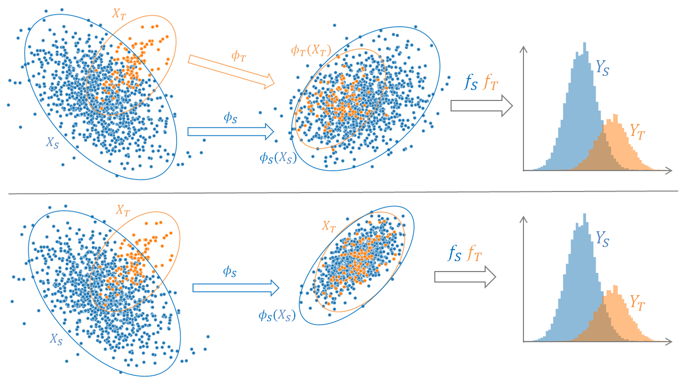
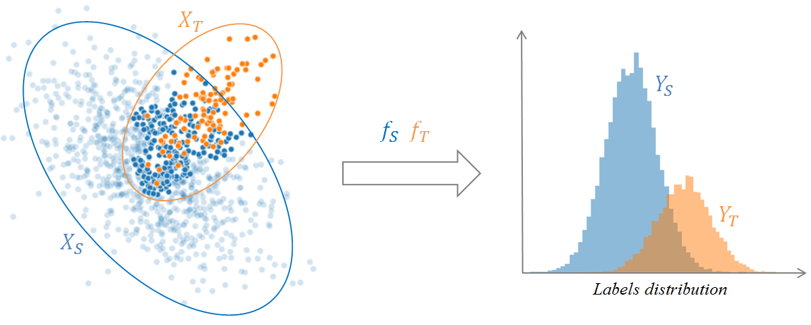
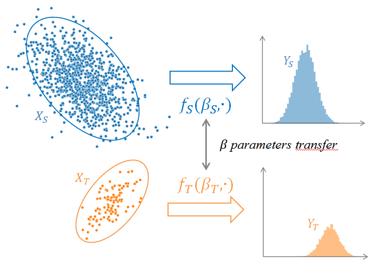

ADAPT
=====

:ref:`ADAPT <index>` is a **Python** package providing some well known **domain adaptation** methods.

The purpose of **domain adaptation (DA)** methods is to handle the common issue encounter in
**machine learning** where training and testing data are drawn according to different distributions.

In **domain adaptation** setting, one is aiming to learn a **task** with an estimator :math:`f` mapping
input data :math:`X` into output data :math:`y` called also **labels**. :math:`y` is either a finite set of integer value
(for **classification** tasks) or an interval of real values (for **regression** tasks).

Besides, in this setting, one consider, on one hand, a **source** domain from which a large sample of **labeled data**
:math:`(X_S, y_S)` are available. And in the other hand, a **target** domain from which **no (or only a few) labeled data** :math:`(X_T, y_T)` are available.
If no labeled target data are available, one refers to **unsupervised domain adaptation**. If a few labeled target data are available
one refers to **supervised domain adaptation** also called **few-shot learning**.

The goal of **domain adaptation** is to build a good estimator :math:`f_T` on the **target** domain by leaveraging information from the **source** domain.
**DA** methods follow one of these three strategies:

 - :ref:`Feature-Based <adapt.feature_based>`
 - :ref:`Instance-Based <adapt.instance_based>`
 - :ref:`Parameter-Based <adapt.parameter_based>`

The following part explains each strategy and gives lists of the implemented methods in the :ref:`ADAPT <index>` package.

.. _adapt.feature_based:

:ref:`adapt.feature_based <adapt.feature_based>`: Feature-Based Methods
-----------------------------------------------------------------------

Feature-based methods are based on the research of common features which have similar
behaviour with respect to the **task** on **source** and **target** domain. 

A new feature representation (often called **encoded feature space**) is built with a 
projecting application :math:`\phi` which aims to correct the difference between **source**
and **target** distributions. The **task** is then learned in this **encoded feature space**.

.. automodule: adapt.feature_based
	:no-members:
	:no-inherited-members:

.. currentmodule:: adapt

.. rubric:: Methods

.. autosummary::
   :toctree: generated/
   :template: class.rst

   feature_based.FE
   feature_based.CORAL
   feature_based.DeepCORAL
   
   
.. _adapt.instance_based:

:ref:`adapt.instance_based <adapt.instance_based>`: Instance-Based Methods
--------------------------------------------------------------------------

The general principle of these methods is to **reweight** labeled training data
in order to correct the difference between **source** and **target** distributions.
This **reweighting** consists in multiplying, during the training process, the individual loss of each training instance by a positive **weight**.

The **reweighted** training instances are then directly used to learn the task.

.. automodule: adapt.instance_based
	:no-members:
    :no-inherited-members:
	
	
	
.. _adapt.parameter_based:

:ref:`adapt.parameter_based <adapt.parameter_based>`: Parameter-Based Methods
-----------------------------------------------------------------------------

In parameter-based methods, the **parameters** of one or few pre-trained models built with
the **source** data are adapted to build a suited model for the **task** on the **target** domain.

.. automodule: adapt.parameter_based
	:no-members:
    :no-inherited-members:
	
	
	
.. _adapt.utils:

:ref:`adapt.utils <adapt.utils>`: Utility Functions
---------------------------------------------------

This module contains utility functions used in the previous modules.

.. automodule: adapt.utils
	:no-members:
    :no-inherited-members:
	
.. currentmodule:: adapt

.. autosummary::
   :toctree: generated/
   :template: function.rst

   utils.check_indexes
   utils.check_estimator
